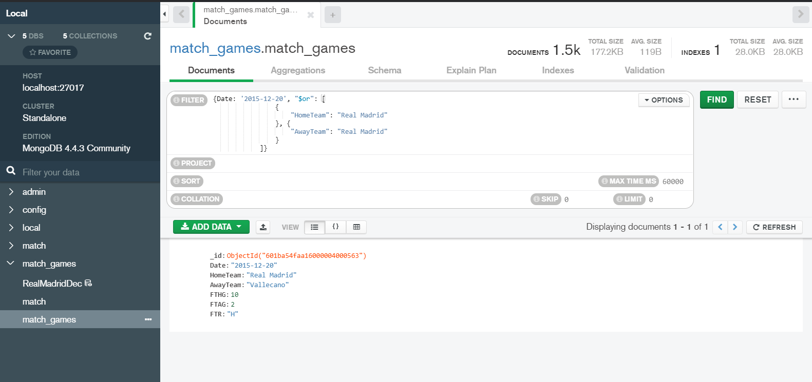

# Postwork Sesión 7

Los integrantes:

  - Manuel García Garduño
  - Luis Rubén Chávez Carrillo
  - Raúl González Cruz
  - Daniel Butron Otero
  
En este Postwork se trabaja con programación en R y con MobgoDB. 

[Aquí](https://github.com/AreYouRuben/DS_Team24/blob/main/Postworks%20R/sesion_7/Postwork_7.R) Puede ver el código.

Para poder trabajar con Mongo se crea una base de datos en localhost llamada match_games.
Después se corre el siguiente script para insertar los datos. 

``` R
conn <- mongo(
  collection = "match_games",
  db = "match_games",
  url = "mongodb://localhost:27017",
  verbose = FALSE,
  options = ssl_options()
)

#   Leer CSV del reto desde el repositorio
data <- read.csv("https://raw.githubusercontent.com/beduExpert/Programacion-con-R-Santander/master/Sesion-07/Postwork/data.csv")
conn$insert(data) 
```

Como se puede observar en la imagen, los datos han sido ingresados a la base de datos.


una de las indicaciones del postwork es la siguiente: 

- Realiza una consulta utilizando la sintaxis de **Mongodb**, en la base de datos para conocer el número de goles que metió el Real Madrid el 20 de diciembre de 2015 y contra que equipo jugó, ¿perdió ó fue goleada?

Estas fechas no se encuentran en los datos descargados directamente del postwork por lo que se descargan los datos del sitio origen y son tratados para que sean compatibles con los ya existentes en la base de datos.

```R
serie1516 <- read.csv("https://www.football-data.co.uk/mmz4281/1516/SP1.csv")
serie1516 <- serie1516 %>%
            select(Date:FTR) %>%
            mutate(
            Date = as.Date(Date,"%d/%m/%y"))

conn$insert(serie1516)
```
De aquí, la consulta desde MongoDB es sencilla y se muestra en la siguiente imagen:



Se observa que el partido terminó en goleada por parte del Real Madrid contra el Vallecano; marcador 10-2.

Esta filtración también se hace desde R como se muestra en el siguiente código.

```R
RealMadrid.Dec <- conn$find('{
            "Date": "2015-12-20", 
            "$or": [
                {
                    "HomeTeam": "Real Madrid"
                }, {
                    "AwayTeam": "Real Madrid"
                }
            ]
        }')
```

 Como actividad extra se decidió trabajar con una serie de datos de los juegos del Real Madrid en diciembre de todos los años antes de ingresar los datos de la serie 2015-2016.

A continuación se muestra el uso de **Aggregations** para filtrar los datos y añadir un campo para determinar si el Real madrid ganó, perdió o empató.


Esta agregación fue hecha *vista* en caso de querer continuar jugando con los datos

