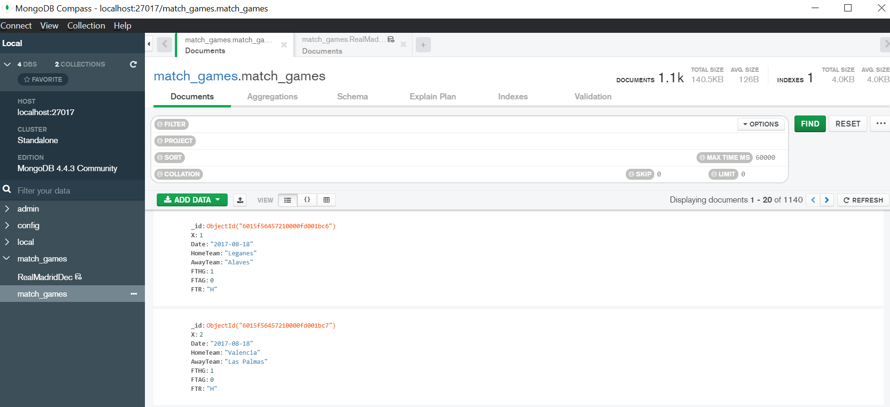
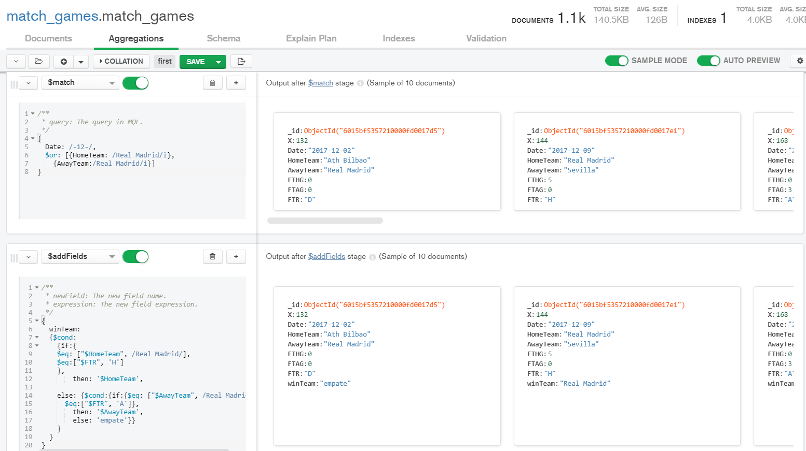
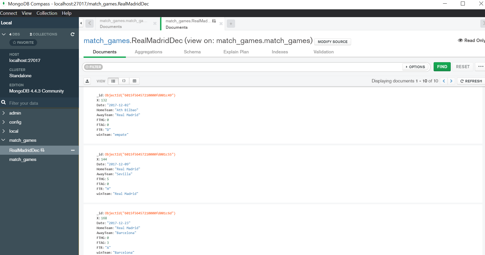

# Postwork Sesión 7

En este Postwork se trabaja con programación en R y con MobgoDB. 

[Aquí](https://github.com/AreYouRuben/DS_Team24/blob/main/Postworks%20R/sesion_7/Postwork_7.R) Puede ver el código.

Para poder trabajar con Mongo se crea una base de datos en localhost llamada match_games.
Después se corre el siguiente script para insertar los datos. 

``` R
conn <- mongo(
  collection = "match_games",
  db = "match_games",
  url = "mongodb://localhost:27017",
  verbose = FALSE,
  options = ssl_options()
)

#   Leer CSV del reto desde el repositorio
data <- read.csv("https://raw.githubusercontent.com/beduExpert/Programacion-con-R-Santander/master/Sesion-07/Postwork/data.csv")
conn$insert(data) 
```

Como se puede observar en la imagen, los datos han sido ingresados a la base de datos.


una de las indicaciones del postwork es la siguiente: 

- Realiza una consulta utilizando la sintaxis de **Mongodb**, en la base de datos para conocer el número de goles que metió el Real Madrid el 20 de diciembre de 2015 y contra que equipo jugó, ¿perdió ó fue goleada?

Estas fechas no se encuentran en los datos descargados directamente del postwork por lo que se decidió trabajar con una serie de datos de los juegos del Real Madrid en diciembre.

A continuación se muestra el uso de **Aggregations** para filtrar los datos y añadir un campo para determinar si el Real madrid ganó, perdió o empató.




Esta agregación fue creada vista en caso de querer continuar jugando con los datos

